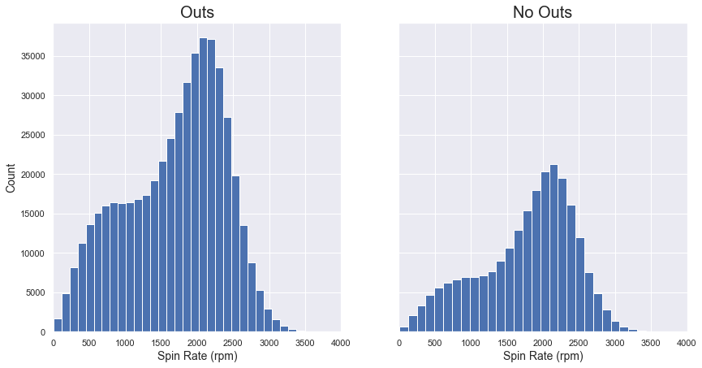
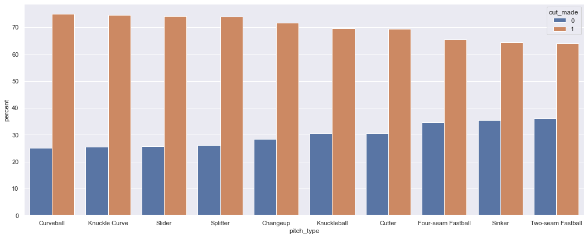

# MLB Pitch Type Analysis

<div style="text-align: center;" style="border: 2px solid black;">
    
</div>

## Overview

I analyzed pitches thrown in Major League Baseball in order to figure out which features of pitching contributed to getting outs.  Although the ability of a pitcher to throw certain types of pitches effectively is crucial, this analysis seeks to find the best attributes for a player to strive for to be successful.  If a team understands which variables or combinations of variables maximize outs, it can find ways to teach young prospects to achieve such results, as well as continue to coach toward those objectives as players move up though the system. 

## Business Problem

Use factors from the data to determine which ones are most significant in recording outs and make good predictions based on these factors?

<div style="text-align: center;" style="border: 2px solid black;">
    
</div>

## Data Understanding

The data was obtained from <a href="https://www.kaggle.com/datasets/pschale/mlb-pitch-data-20152018/?select=2019_pitches.csv">Kaggle</a>.  The complete dataset contained multiple files, and I used the pitches and atbats .csv files from 2015-2019, merging them all into one DataFrame.

There were originally over 3.5 million observations, specifically pitches thrown in MLB from 2015-2019.  I was interested in the approximately 925,000 results from the at bats over those years.  Those results were broken down into outs and plays that did not include outs, and pitch types that were used sparingly were not considered.

The data contained some limitations, however.  The spin rates and directions of the pitches from 2019 were not recorded.  Also, some of the columns were not explained in enough detail, if at all, to be utilized.

In addition to the primary independent variable of interest, pitch type, I investigated the effects of pitch speed on the outcome of an at bat and discovered that speed alone is not very predictive.


Next, I looked at the pitches' spin rates to determine any pattern, but that variable on its own does not offer much predictive value.



## Modeling

I used different classification models to try to predict the outcome of the target variable, whether or not an out was made.  I only considered the top ten most frequent pitch types and from those, looked at the five that had the highest ratio of outs made.



After all data cleaning, I had almost 284,000 rows of data to use for modeling, and about 73.6% of these had a positive outcome of making an out.  I used the following classification models with multiple different hyperparameters to try to improve the predictive accuracy: decision tree, LightGBM, logistic regression, and k-Nearest Neighbors.  None of those, however, managed to increase accuracy by more than a percentage point.

Next, I balanced the data to get the same number of entries with an out and without an out by undersampling the majority class.  This provided about 150,000
at bats to observe, and it did show some improvements in the models.  All of the aforementioned models saw their accuracies raise by at least 4.7% from the 50% expected, and the LightGBM model had the highest improvement with a 58.2% accuracy.

## Recommendations

- **Focus on successful pitches**

Make an effort to teach young pitchers in the minor leagues the pitch types with the highest rates of getting outs (curveball, kknuckle curve, slider, splitter, changeup).

- **Don't make it one size fits all**

Individualize which of those pitches work with each pitcher rather than trying to force them all on everyone.

- **Utilize additional data**

Add more variables and datapoints to the evaluations, including minor league data, to enhance results and further coaching opportunities.

## Future Considerations

- **Study pitch sequencing**

The order of pitches that the batter faces can have an effect on his success.

- **Measure different targets**

Looking at outcomes beyond the actual outs may provide a better understanding of pitch effectiveness.  Exit velocity and launch angle of the ball off the bat are also important to know. 

- **Monitor trends closely**

Baseball can shift pretty quickly, especially recently with so many new rule changes, such as the pitch clock and defensive positioning limits.  And another big one is likely to come--the automated ball-strike (ABS) challenge system.

## Appendix

The complete analysis can be found in the <a href="MLB_pitch_analysis.ipynb">Jupyter Notebook</a> and in the <a href="pitch_analysis_presentation.pdf">presentation</a>.
<br>
For questions, please contact Dan Rosen at <a href="mailto:dan_rosen@outlook.com">dan_rosen@outlook.com</a>.

## Repository Structure

You are in the README.md.  The 'MLB_pitch_analysis.ipynb' contains the jupyter notebook that explains the data science steps for you to replicate.  The 'pitch_analysis_presentation.pdf' contains the Google slides presentation that sums up important information for the audience.  In 'Data' you will be able to see the dataset used.  Likewise, 'Images' will contain images used.


```bash

├── Data                                    <- Data file used in this project

├── Images                                  <- Images and Graphs used in this project obtained from external and internal sources

├── .gitignore                              <- Contains list of files to be ignored from GitHub

├── pitch_analysis_presentation.pdf         <- Slide Presentation of the project

├── README.md                               <- Contains README file to be reviewed

└── MLB_pitch_analysis.ipynb                <- Jupyter notebook of the project containing codes and analysis